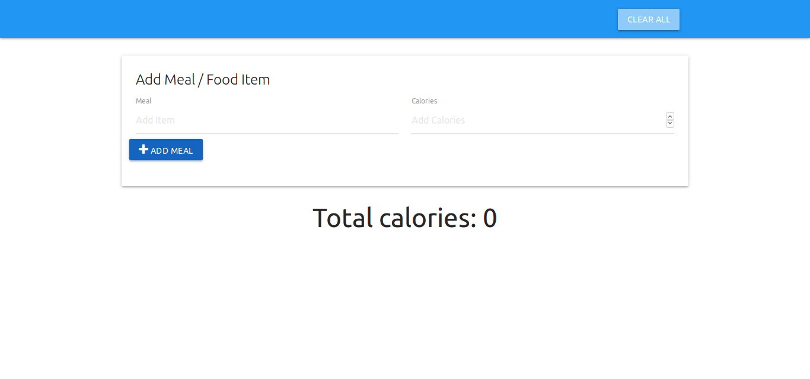
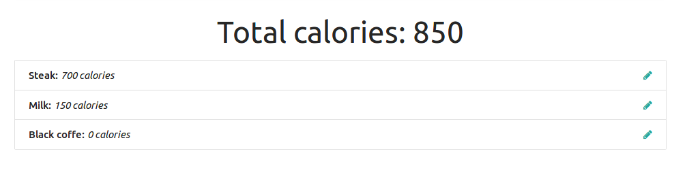
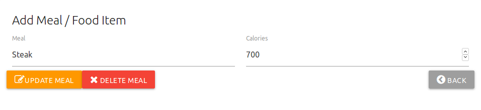

# Track calories webpage :hamburger::orange::pineapple:

## screenshot

## build materail webpage 
## use JS pattern to : 
- Add new item :heavy_check_mark  :heavy_check_mark:
- remove single item  :heavy_check_mark:
- update item . :heavy_check_mark:
- delete all items  :heavy_check_mark:
- store items in local storage :floppy_disk:
- delete items from local storage :heavy_check_mark:
- remove all items from local storage :warning:

